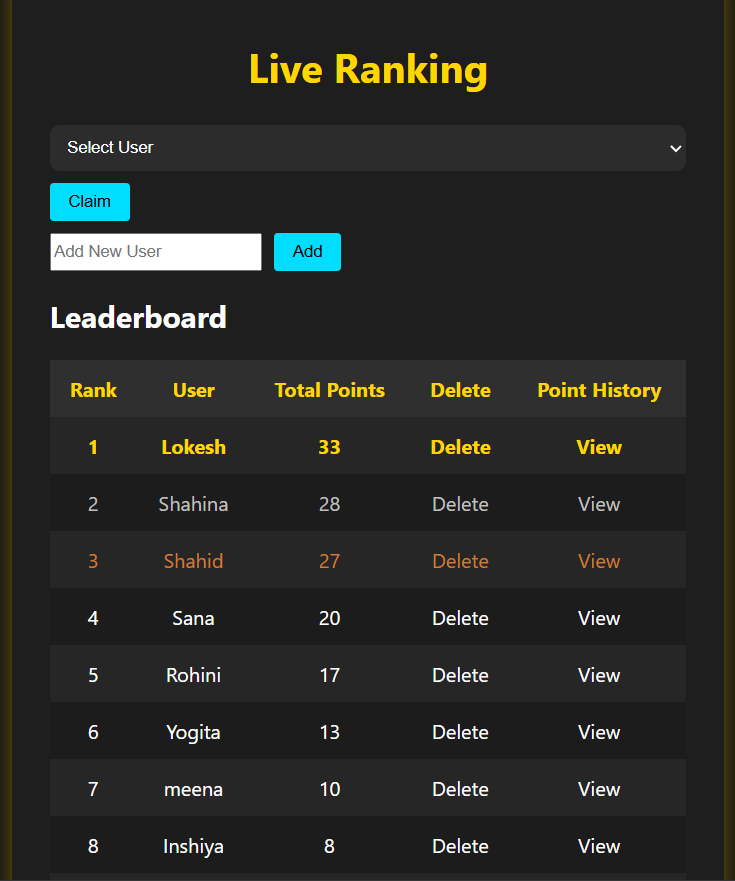

# Leaderboard Application

A full-stack **Leaderboard App** built with **ReactJS**, **Node.js**, **Express**, and **MongoDB**. Users can:
- Select a username
- Claim random points (1–10)
- View dynamic leaderboard rankings
- Track individual claim history

---

## UI Preview



---

##  Live Preview

 [Demo Link (If deployed)](https://leaderboard-frontend-vh2l.onrender.com)

---

##  Features

- Real-time leaderboard with dynamic ranks
- User selection from top 10 (or add new)
- Random points generator (1–10 points)
- Claim history tracking
- MongoDB storage
---

## Tech Stack

**Frontend:**
- ReactJS
- Axios

**Backend:**
- Node.js
- Express.js
- MongoDB (Mongoose)
- Cors

---

## .env Configuration

For `Backend/.env`:

---

## 🛠Installation Steps

### 1. Clone the Repository
```bash
git clone https://github.com/Inshiya1904/LeaderBoard.git
cd LeaderBoard
```

### 2. Install Client Dependencies
```bash
cd Frontend
npm install
```

### 4. Install Server Dependencies
```bash
cd Backend
npm install
```

### 5. Start Servers
```bash
# Start Backend
cd Backend
npm run dev
```

### 6. start Frontend
```bash
cd Frontend
npm run dev
```


